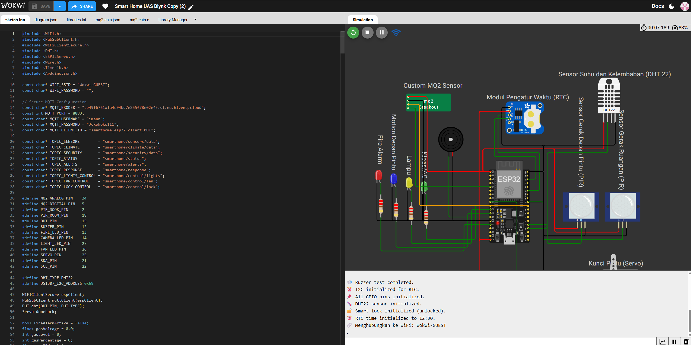

# 🏡 Smart Home IoT Dashboard

Project ini adalah sistem monitoring dan kontrol **Smart Home berbasis IoT** menggunakan **ESP32 (Wokwi Simulator)**, **MQTT**, **Node.js (Express)**, dan **MySQL**. Sistem ini menampilkan data sensor, memberikan notifikasi kebakaran/keamanan, serta mengontrol perangkat secara otomatis maupun manual dari dashboard web.

---

## 🚀 Fitur Utama

- Deteksi gas (MQ2), suhu dan kelembapan (DHT22), gerakan (PIR)
- Sistem notifikasi otomatis: kebakaran & keamanan
- Kontrol lampu, dan kipas (mode ON, OFF, AUTO)
- Kontrol smart lock (LOCK, UNLOCK)
- Dashboard web real-time (HTML, CSS, JS)
- Komunikasi data menggunakan **MQTT**

---

## 🧪 Setup ESP32 di Wokwi

1. **Buat Project baru** di [Wokwi](https://wokwi.com/)
2. Pilih **Board: ESP32 Dev Module**
3. Pilih **Framework: Arduino**
4. Upload file `sketch.ino`  dan `diagram.json` yang tersedia di repository
5. Tambahkan **chip custom MQ2**:
   - Buat dua file:
     - `mq2.chip.json`
     - `mq2.chip.c`
6. Pastikan kredensial MQTT di `sketch.ino` sudah benar (gunakan akun pribadi HiveMQ jika perlu)
7. Jalankan Project dan pastikan ESP32 berhasil terhubung ke MQTT
8. Wokwi anda seharusnya terlihat seperti ini setelah setup
   

---

## 🖥️ Setup Backend (Node.js + Express)

### 1. Buat database MySQL
```sql
CREATE DATABASE smarthome_db;
```
### 2. Install dependencies
```bash
npm install express mysql2 dotenv cors
```
### 3. Jalankan server
```bash
node server.js
```
## 🌐 Setup Frontend (Dashboard)

### 1. Buka file index.html menggunakan Live Server (VS Code Extension)

### 2. Dashboard akan menampilkan:

### - Data sensor secara real-time

### - Notifikasi kebakaran dan keamanan terbaru

### - Tombol kontrol lampu, kipas, dan pintu

## ℹ️ Catatan Tambahan

### - Project ini untuk keperluan tugas akhir mata kuliah Pembangunan Perangkat Lunak Berorientasi Service
### - Kredensial MQTT disimpan langsung di sketch.ino dan .env
